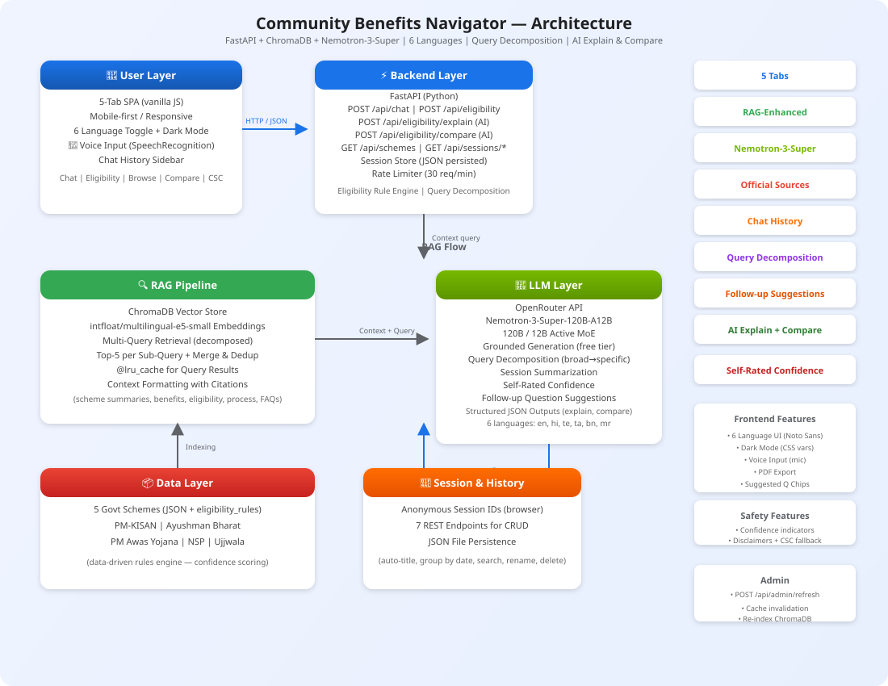

# Project Name: Community Benefits Navigator

**Track:** Track 1 - Community Benefits Navigator

**Team Name:** shinde_vinayak_rao_patil

---

### Abstract

**Problem:** Over 40% of Indian citizens struggle to navigate government welfare schemes due to language barriers, complex eligibility rules, and fragmented information across departments.

**Who benefits:** Farmers (PM-KISAN income support), students (NSP scholarships), women (PM Ujjwala LPG connections), and low-income families (Ayushman Bharat health insurance, PM Awas housing).

**Why Nemotron-3-Super:** The 120B MoE architecture delivers strong multi-step reasoning with only 12B active parameters per token, enabling complex query decomposition and session summarization entirely within the OpenRouter free tier. Its multilingual capabilities power grounded responses across 6 Indian languages without separate translation pipelines.

---

### Project Links
- **YouTube Demo:** https://drive.google.com/file/d/1EOJBqOfedNXyRIfe9ixPwdkRdaK6oaiQ/view?usp=drive_link
- **Blog Post:** https://medium.com/@shindevinayakraopatil/nemotron-3-super-as-a-multi-tool-how-one-120b-moe-model-handles-rag-query-decomposition-cec551935346
- **LinkedIn Post:** https://www.linkedin.com/posts/shindeaidevloper_hydpy-nvidia-hydpy-ugcPost-7467295550594371584-tQHq/

---

### Architecture



The system follows a **RAG (Retrieval-Augmented Generation)** pattern with 5 layers:

1. **Frontend** (HTML/CSS/JS) — 5-tab SPA with chat, eligibility checker, scheme browser, comparison tool, and CSC Locator (Leaflet.js map). Includes **chat history sidebar**, voice input (SpeechRecognition), dark mode, PDF export, **AI-powered eligibility explanation**, **AI scheme comparison**, **suggested follow-up questions**, and a **6-language UI** (English, Hindi, Telugu, Tamil, Bengali, Marathi).
2. **Backend** (FastAPI) — Python API server with **18+ REST endpoints**, config management, rate limiting (30 req/min), structured logging, JSON-persisted **session store** with 7 CRUD endpoints, data-driven **eligibility rule engine**, **LLM-based eligibility explainer**, **LLM-based scheme comparison**, admin cache management, and **query decomposition** for broad questions.
3. **RAG Pipeline** (ChromaDB + intfloat/multilingual-e5-small) — Embeds scheme documents and retrieves top-5 relevant chunks per query. Supports **multi-query retrieval**: broad questions are decomposed into sub-queries with results merged and deduplicated. Query results are **LRU-cached** for performance.
4. **LLM** (NVIDIA Nemotron-3-Super via OpenRouter free tier) — Generates grounded responses using retrieved context with multi-language prompt engineering, citation tracking, **follow-up question suggestions**, **self-rated confidence scoring**, **session-aware context** via automatic summarization, and **structured JSON outputs** for eligibility explanations and scheme comparisons.
5. **Data Layer** — Structured JSON files for 5 central government schemes, each with **data-driven `eligibility_rules`** and **`confidence_scoring`** objects evaluated by a generic rule engine.

---

### Description

**How it uses Nemotron-3-Super:**

The Community Benefits Navigator helps Indian citizens discover, understand, and apply for central government welfare schemes. It leverages **NVIDIA Nemotron-3-Super** (via OpenRouter API) as the reasoning engine:

- **Grounded Generation:** Every user query first triggers a RAG retrieval step that pulls relevant scheme documents from ChromaDB. The Nemotron model receives this context as part of the system prompt and is instructed to **only answer from the provided documents**, ensuring faithfulness to official sources.
- **Citation Tracking:** Each response includes confidence-badged citations showing exactly which scheme document section was used.
- **Eligibility Reasoning:** A data-driven rule engine evaluates eligibility against profile information — rules are stored in scheme JSON files, making the system extensible without code changes.
- **Query Decomposition:** Broad questions like "what schemes am I eligible for?" are automatically split into specific sub-queries by the LLM, each answered from a single scheme document, then merged for a comprehensive response.
- **Multi-Query Retrieval:** Results from all sub-queries are merged, deduplicated, and re-ranked for relevance, ensuring broad questions get complete coverage.
- **Session Summarization:** Long conversations are automatically summarized by the LLM and injected as context, keeping the model aware of earlier turns without overflowing the context window.
- **Follow-up Suggestions:** The LLM generates 3 relevant follow-up questions with every response, shown as clickable chips in the UI.
- **Self-Rated Confidence:** The LLM outputs a confidence score embedded in its response — extracted, parsed, and displayed as a color-coded indicator (green/yellow/red).
- **AI Explain Eligibility:** After rule-based eligibility checking, users can get a personalized plain-language explanation with best scheme recommendation, next steps, and improvement tips — all generated by the LLM.
- **AI Scheme Comparison:** A dedicated endpoint compares any two schemes using the LLM, highlighting key differences, providing recommendations, and indicating whether both can be applied for.
- **Smart Query Handling:** Greeting detection skips RAG for casual messages, reducing latency and API costs.
- **6-Language Support:** Nemotron's multilingual capabilities enable 6 languages (English, Hindi, Telugu, Tamil, Bengali, Marathi) with per-language greeting replies and Noto Sans fonts for each script.
- **Voice Input:** Mic button using SpeechRecognition API with language-aware recognition for accessibility.
- **Chat History Sidebar:** ChatGPT-style slide-out panel with grouped conversations (Today/Yesterday/Last 7 Days/Earlier), search, rename, delete, and server-side JSON persistence.
- **Safety by Prompt Design:** The system prompt includes strong grounding constraints, a "don't know" fallback instruction, and mandatory CSC referral for uncertain answers.

**Key features:**
- **5-tab SPA** — Chat (with history sidebar), Eligibility Checker, Scheme Browser, Compare (side-by-side + AI), CSC Locator (Leaflet.js map with Nominatim geocoding)
- **Data-driven eligibility rules engine** — Rules stored in scheme JSONs (no hardcoded if/elif chains)
- **LLM-based Explain Eligibility** — Personalized plain-language explanation with best scheme, next steps, and improvement tips
- **AI Scheme Comparison** — LLM-generated comparison with key differences, recommendation, and joint-applicability check
- **Query Decomposition** — Broad questions auto-split into sub-queries for complete RAG coverage
- **Multi-Query Retrieval** — Merged, deduplicated results from decomposed sub-queries
- **Follow-up Suggestions** — 3 clickable follow-up questions generated with every response
- **Self-Rated Confidence** — LLM outputs confidence score, parsed and displayed as color-coded indicator
- **Session Summarization** — Long conversations auto-summarized and injected as context
- **Session management** — Anonymous session IDs with server-side persistence, auto-titling from first message
- **Scheme data caching** — `@lru_cache` for scheme data and RAG query results
- **Singleton embedding model** — Loaded once at startup, shared across requests
- **HTTP connection pooling** — Shared `httpx.AsyncClient` via `app.state`
- **Rate limiting** — 30 requests/minute per client with `X-RateLimit-*` headers
- **Config validation** — On startup with structured logging
- **Greeting detection** — Regex skips RAG for casual messages, reducing latency and API costs
- **PDF export** — Download eligibility results via html2pdf.js
- **Side-by-side scheme comparison** — Static table comparison of any two schemes
- **CSC Locator** — Interactive map with search, geocoding, markers for 10 major cities
- **Dark mode** — CSS variable override, respects `prefers-color-scheme`
- **Admin endpoints** — `POST /api/admin/refresh` for cache invalidation and re-indexing (guarded by `ADMIN_KEY`)
- **6-language UI** — Full UI translation with Noto Sans Devanagari/Telugu/Tamil/Bengali fonts
- **Auto-resizing chat input** — Textarea grows with content

**Schemes supported:**
1. **PM-KISAN** (`pm_kisan`) — Income support for farmers (₹6,000/year)
2. **Ayushman Bharat / PM-JAY** (`ayushman_bharat`) — Health insurance (₹5L/family/year)
3. **PM Awas Yojana** (`pm_awas_yojana`) — Housing subsidy for EWS/LIG/MIG
4. **National Scholarship Portal** (`nsp_scholarships`) — Education scholarships for SC/ST/OBC/Minority students
5. **PM Ujjwala Yojana** (`ujjwala`) — Free LPG connections for BPL women

*Each scheme JSON includes `eligibility_rules` and `confidence_scoring` — add new schemes by dropping in a JSON file, no code changes needed.*

---

### Unique Value Propositions

| # | Differentiator | What It Means |
|---|---|---|
| 1 | **Query Decomposition** | Unlike standard RAG that retrieves once per question, this system uses the LLM to split broad questions (e.g., "what schemes am I eligible for?") into per-scheme sub-queries, retrieves context for each, then merges and deduplicates results — covering all relevant schemes in one response. |
| 2 | **Multi-Role LLM** | A single Nemotron-3-Super handles **6 distinct roles** — grounded answerer, eligibility explainer, scheme comparer, recommendation engine, session summarizer, and FAQ responder — all through prompt engineering and structured JSON output, no fine-tuning needed. |
| 3 | **Self-Rated Confidence** | Every LLM response includes an embedded confidence score extracted via regex (no extra API call) and displayed as a color-coded indicator — giving users transparency into how certain the model is about its answer. |
| 4 | **Data-Driven Rule Engine** | Eligibility rules live in scheme JSON files, not hardcoded if/elif chains. Adding a new scheme = dropping in a JSON file. The generic rule engine evaluates age, income, location, gender, and social category automatically. |

---

### Tech Stack

| Layer | Technology |
|---|---|
| Frontend | HTML, CSS, Vanilla JavaScript, Leaflet.js (map), html2pdf.js (PDF) |
| Backend | Python, FastAPI, httpx |
| LLM | NVIDIA Nemotron-3-Super via [OpenRouter](https://openrouter.ai/nvidia/nemotron-3-super-120b-a12b:free) (free tier) |
| Vector DB | ChromaDB |
| Embeddings | `intfloat/multilingual-e5-small` (Hugging Face) |
| Session Store | JSON file persistence (`backend/data/sessions.json`) |
| Maps | OpenStreetMap + Nominatim (free geocoding) |
| Voice | Web SpeechRecognition API |
| Code Quality | ruff, mypy, pytest |

---

### Quick Start

**Prerequisites:**
- Python 3.10+
- OpenRouter API key (free) — [get one here](https://openrouter.ai/keys)
- 4GB+ RAM

**Run in 3 commands:**
```bash
git clone https://github.com/Shindevrp/meetup-nvidia-nemotron-3-super
cd submissions/track_1_community_benefits_navigator/shinde_vinayak_rao_patil
./setup.sh
```

**Start the server:**
```bash
./run.sh
```

**Open:** [http://localhost:8000](http://localhost:8000)

You should see a 5-tab SPA with Chat (history sidebar), Eligibility Checker, Scheme Browser, Compare tool, and CSC Locator map.

> **Demo:** [YouTube Walkthrough](https://drive.google.com/file/d/1EOJBqOfedNXyRIfe9ixPwdkRdaK6oaiQ/view?usp=drive_link)

**Manual Setup:**
```bash
python -m venv .venv
source .venv/bin/activate
pip install -r backend/requirements.txt
cp backend/.env.example backend/.env
# Edit backend/.env → add your OpenRouter API key
cd backend && uvicorn main:app --reload --host 0.0.0.0 --port 8000
```

---

### Judging Criteria Mapping

| Criterion | How We Address It |
|---|---|
| **Community Value** | Solves real problem — 40%+ Indians seek help with welfare schemes but face language, literacy, and awareness barriers. 6 languages cover ~80% of Indian population. CSC Locator connects users to help centres. |
| **Grounded Accuracy** | RAG pipeline ensures every answer cites official scheme documents; model instructed to refuse ungrounded queries; confidence-badged citations; LRU-cached retrieval; query decomposition covers broad questions via multi-query retrieval with deduplication; self-rated LLM confidence provides transparency. |
| **Actionability** | Generates checklists, step-by-step guides, document lists, eligibility assessments, AI-powered eligibility explanations (with best scheme, next steps, improvement tips), AI scheme comparisons, downloadable PDF reports, CSC centre locations on an interactive map, and suggested follow-up questions for deeper exploration. |
| **Safety** | Confidence indicators (green/yellow/red), mandatory disclaimers, CSC referral fallback, rate limiting (30 req/min), input validation, admin-protected refresh endpoint. |
| **Equity/Accessibility** | 6-language UI (en/hi/te/ta/bn/mr), voice input for low-literacy users, mobile-first responsive design, dark mode, Noto Sans fonts for all scripts. |
| **Operational Efficiency** | ChromaDB retrieval ~200ms; scheme data LRU-cached; singleton embedding model; HTTP connection pooling; query result caching; JSON-persisted session store; lightweight frontend loads instantly. |

---

### Project Structure

```
submissions/track_1_community_benefits_navigator/shinde_vinayak_rao_patil/
├── README.md
├── architecture.svg
├── setup.sh                    # One-click setup script
├── run.sh                      # Server launcher
├── pyproject.toml              # Python project metadata
├── backend/
│   ├── main.py                 # FastAPI app: 18+ endpoints, config, rate limiter, session store, explain/compare routers
│   ├── requirements.txt        # Python dependencies
│   ├── .env.example            # API key configuration template
│   ├── rag/
│   │   ├── embedder.py         # Document embedding & ChromaDB indexing (singleton model)
│   │   ├── retriever.py        # Semantic search retrieval with LRU cache
│   │   └── loader.py           # Data loading & indexing entry point
│   ├── models/
│   │   ├── chat.py             # Chat orchestration, query decomposition, multi-query RAG, session summarization, follow-up generation, confidence extraction, explain/compare LLM calls, eligibility rule engine, greeting detection
│   │   └── schemes.py          # Scheme data models, caching, rule evaluation
│   └── data/
│       ├── schemes/            # JSON files for 5 schemes with eligibility_rules
│       ├── sessions.json       # Persisted chat sessions (auto-created)
│       └── faqs.json           # General FAQ data
└── frontend/
    ├── index.html              # 5-tab SPA: Chat, Eligibility, Schemes, Compare, CSC
    ├── style.css               # Mobile-first responsive styles + dark mode
    └── app.js                  # Frontend logic (sidebar, voice, PDF, map, compare)
```

---

### Timeline

- **Data Collection & Structuring:** 2 days
- **Backend (FastAPI + RAG + NIM):** 3 days
- **Frontend (UI + Integration):** 3 days
- **Safety & Polish:** 2 days
- **v2.0 Performance & Architecture:** 1 day
- **v2.1 Multi-language + Voice + CSC Locator:** 1 day
- **v2.2 Chat History Sidebar:** 1 day
- **v2.3 Query Decomposition + Multi-Query RAG:** 1 day
- **v2.4 Follow-up Suggestions + Self-Rated Confidence:** 1 day
- **v2.5 AI Explain Eligibility + AI Compare Schemes:** 1 day
- **Documentation & Demo:** 2 days

---

### License

This project is submitted as part of the Nemotron 3 Super Meetup Contest by HydPy Community.
